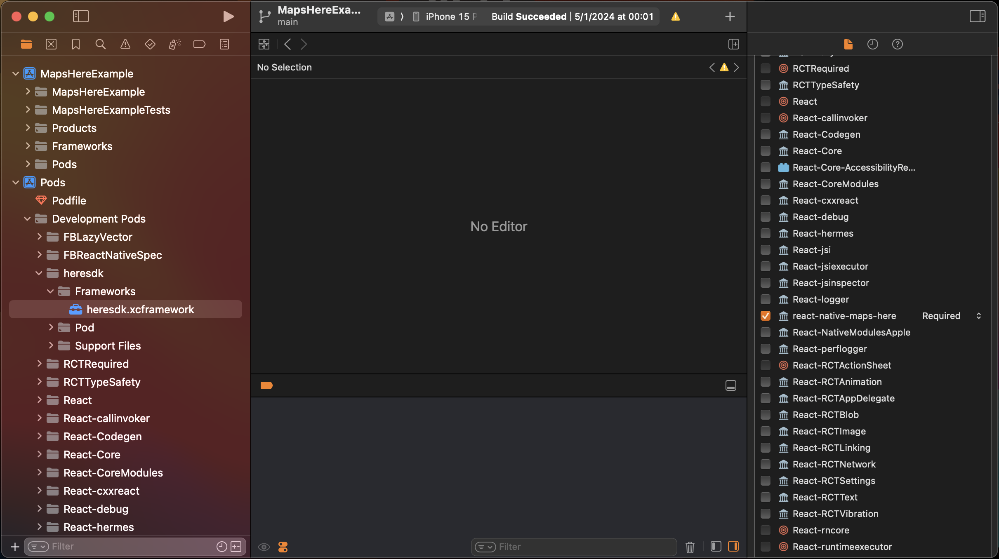

<h1 align="center">
    <strong>Installation</strong>
</h1>

Before we can use the HERE SDKs properly, we have to do some manual setup to get it to work.

## Installing the library

```sh
# using npm
npm install react-native-here-explore

# using yarn
yarn add react-native-here-explore
```

## 1. Sign up to [HERE Platform](https://platform.here.com/sign-up)

First, you need to get the access keys from the official HERE web portal.

Keep in mind that providing the billing info is important to unlock the SDKs for both iOS and Android.

## 2. Register a new app

Go to this [link](https://platform.here.com/admin/apps?action=new-registration) and register a new application.

After that, it should bring you to a menu with the tab `Credentials` selected by default.

On the left menu, select **OAuth 2.0** and click **Create credentials**.

A popup menu will show up saying: **Your access key ID and secret were created** with a Download button to get the credentials.

The content of your downloaded file should be like this:

```env
here.user.id = YOUR_USER_ID
here.client.id = YOUR_APP_ID
here.access.key.id = ACCESS_KEY_ID
here.access.key.secret = ACCESS_KEY_SECRET
here.token.endpoint.url = https://account.api.here.com/oauth2/token
```

This step is important to get the access keys that you will then use to initialize the SDKs later on.

## 3. Download the [HERE SDK Explore Edition](https://platform.here.com/portal/sdk)

On the page above, you will see a list of SDKs. The ones you need are:

- **HERE SDK Explore Edition for Android**
- **HERE SDK Explore Edition for iOS**

If you signed in and added billing info, you should see a **Get now** button to download each SDK.

## 4. Extract and move the SDKs to your project

- ### Android

After you download and extract the zip file, you should see a .aar file amongst many others.

Copy that file and place it in `your-project/android/heresdk` folder.

Then go to your `your-project/android/app/build.gradle` file and edit the dependencies block like below:

```gradle
dependencies {
    // ... other react dependencies

    // Import HERE SDK
    implementation fileTree(dir: file("../heresdk"), include: ['*.aar'])
}
```

- ### iOS

After you download and extract the zip file, you should see a .xcframework folder (heresdk.xcframework).

Copy that file and place it in `your-project/ios/Frameworks` folder.

In the same folder (i.e., `your-project/ios/Frameworks`), create a podspec file with the name `heresdk.podspec` and paste in the following:

```podspec
Pod::Spec.new do |s|
  s.name         = "heresdk"
  s.version      = "1.0.0"
  s.summary      = "Description of HERE SDK"
  s.homepage     = "https://platform.here.com/portal/sdk"
  s.author       = { "HERE Team" => "author@example.com" }
  s.source       = { :http => 'http://example.com/heresdk.zip' }
  s.platform     = :ios
  s.ios.vendored_frameworks = 'heresdk.xcframework'
end
```

Note that: The information in this podspec doesn't have to be exact since we only want Cocoapods to recognize the xcframework.

After that, open `your-project/ios/Podfile` and add the library you just moved:

```podspec
target 'MapsHereExample' do
  # ... some stuff

  use_react_native!(
    # ...some other stuff
  )

  # Import HERE SDK
  pod 'heresdk', :path => 'Frameworks'
end
```

Finally, in your terminal, run `pod install`.

If the app doesn't run properly on iOS, then you have to manually add `react-native-here-explore` to the Target Membership of `heresdk`. You do so by opening Xcode and navigating to the `heresdk.xcframework` package inside the `Pods/Development Pods/heresdk`, then checking `react-native-here-explore` on the right menu as shown in the image below:



## Authenticate using credentials

After setting up the SDKs on both platforms, we should initialize it using the `ACCESS_KEY_ID` and `ACCESS_KEY_SECRET` that we retrieved previously.

Just go to your index.ts file and add this before the `AppRegistry.registerComponent(appName, () => App)`:

```typescript
import { MapsHereConfig } from 'react-native-here-explore';

MapsHereConfig.initializeHereSDK(
  'YOUR_ACCESS_KEY_ID',
  'YOUR_ACCESS_KEY_SECRET'
);
```

If all done correctly, you should have HERE Maps working.
